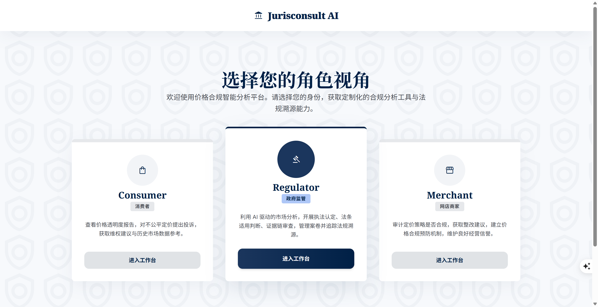
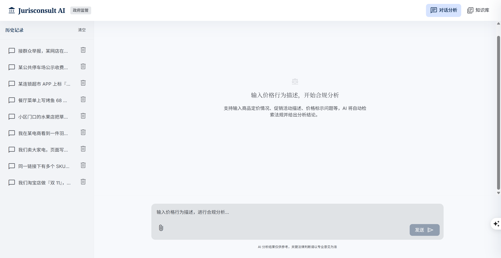
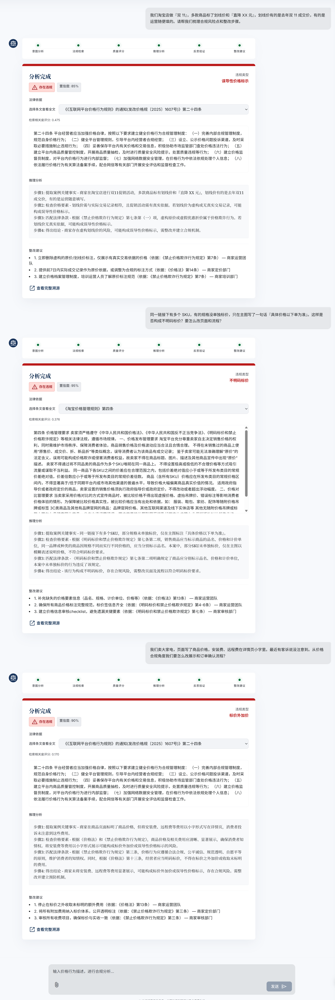

# Price Regulation Agent

电商价格合规智能分析项目。  
从「是否违规」到「法律依据」再到「可执行建议」，提供可评测、可追溯、可交互的完整链路。

## Why This Project

价格违规判断常见问题是：

- 只能给结论，缺少法律依据
- 解释不稳定，难以复查
- 无法面向不同角色（消费者/监管/商家）给出可执行建议

本项目将这条链路做成三种可对比范式：`Baseline`、`RAG`、`Agent`，并配套 Web 系统用于演示与溯源。

## Features

- **三路线对比**：同一评测集下对比 `Baseline / RAG / Agent`
- **可追溯输出**：保留结构化结果与评测过程信息
- **角色化建议**：支持消费者、监管、商家三类视角
- **评测工程化**：统一脚本、统一结果目录、支持报告产出
- **Web 交互系统**：支持流式交互、历史查询与知识库浏览

## Snapshot


### Web 工作台




### 分析结果与法律依据




## Tech Routes

- **Baseline**：直接大模型判定与解释
- **RAG**：法规/案例检索增强后推理
- **Agent**：6 节点编排（意图 -> 检索 -> 评分 -> 推理 -> 反思 -> 建议）

## Repository Map

```text
price_regulation_agent/
├── src/         # baseline / rag / agents / evaluation
├── scripts/     # 评测、对比、数据脚本
├── web/         # FastAPI + React 应用
├── data/        # 数据集与原始材料
├── results/     # 实验与评测结果
├── docs/        # 文档与归档
└── configs/     # 模型与运行配置
```

## Documentation

- **使用与启动（完整）**：`README_使用指南.md`
- **Web 子系统说明**：`web/README.md`
- **项目文档与归档**：`docs/`

## Roadmap

- [x] Baseline 路线打通与批量评测
- [x] RAG 路线实现与对比报告
- [x] Agent 多节点流程与 trace
- [x] Web 交互系统（角色化建议 + 溯源）
- [ ] 增加 benchmark 可视化看板
- [ ] 提升评测自动化与 CI 校验
- [ ] 补充公开演示数据与最小复现实验包

## For Contributors

欢迎提 Issue / PR，尤其是以下方向：

- 法律条文引用稳定性优化
- 推理链可解释性评估增强
- 结果可视化和前端体验提升
- 数据与实验复现流程完善


## License

当前仓库尚未声明开源许可证。  
若计划公开发布，建议补充 `LICENSE`（如 MIT / Apache-2.0）。
