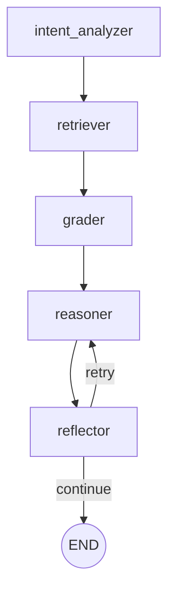

# Agent系统实现详细报告（方案B）

**创建日期**: 2026-03-25
**项目**: 电商价格合规智能体系统
**方案**: 标准Agentic RAG（5节点工作流）

---

## 目录

1. [系统架构总览](#1-系统架构总览)
2. [Node 1: Intent Analyzer（意图分析器）](#2-node-1-intent-analyzer意图分析器)
3. [Node 2: Adaptive Retriever（自适应检索器）](#3-node-2-adaptive-retriever自适应检索器)
4. [Node 3: Grader（质量评分器）](#4-node-3-grader质量评分器)
5. [Node 4: Reasoning Engine（推理引擎）](#5-node-4-reasoning-engine推理引擎)
6. [Node 5: Reflector（自我反思验证器）](#6-node-5-reflector自我反思验证器)
7. [LangGraph工作流集成](#7-langgraph工作流集成)
8. [完整执行示例](#8-完整执行示例)

---

## 1. 系统架构总览

### 1.1 工作流示意图

```
┌─────────────────────────────────────────────────────────────────┐
│                   Agent Coordinator (LangGraph)                  │
└─────────────────────────────────────────────────────────────────┘
                                │
                                ▼
                        ┌───────────────┐
                        │ 1. Intent     │
                        │   Analyzer    │
                        └───────────────┘
                                │
                        提取关键实体、预测违规类型
                        动态决定TopK
                                │
                                ▼
                        ┌───────────────┐
                        │ 2. Adaptive   │
                        │   Retriever   │
                        └───────────────┘
                                │
                        BM25+Semantic+RRF+CrossEncoder
                        动态TopK检索
                                │
                                ▼
                        ┌───────────────┐
                        │ 3. Grader     │
                        │  (Scoring)    │
                        └───────────────┘
                                │
                        多维评分：相关性+覆盖度+时效性
                        过滤低质量文档
                                │
                                ▼
                        ┌───────────────┐
                        │ 4. Reasoning  │
                        │    Engine     │
                        └───────────────┘
                                │
                        Chain-of-Thought推理
                        输出推理链+结论
                                │
                                ▼
                        ┌───────────────┐
                        │ 5. Reflector  │
                        │ (Validation)  │
                        └───────────────┘
                                │
                    验证法律引用+逻辑一致性
                                │
                        ┌───────┴───────┐
                        │               │
                    通过验证        发现问题
                        │               │
                        ▼               ▼
                  Final Result    Re-Reason
                                  (最多1次)
```

### 1.2 数据流

```python
# 输入
query: str = "某酒店在携程划线价3000元，实际预订价198元，无前7日成交记录"

# Node 1 输出
intent: dict = {
    "violation_type_hints": ["虚构原价", "虚假折扣"],
    "key_entities": {...},
    "complexity": "medium",
    "suggested_laws_k": 3,
    "suggested_cases_k": 5
}

# Node 2 输出
retrieved_docs: list = [
    {"type": "law", "content": "《禁止价格欺诈规定》第7条...", "distance": 0.08},
    {"type": "law", "content": "《价格法》第14条...", "distance": 0.12},
    {"type": "case", "content": "案例1: 某酒店虚构原价...", "distance": 0.15},
    ...
]

# Node 3 输出
graded_docs: list = [
    {"content": "...", "final_score": 0.92, "relevance": 0.95, "coverage": 0.85, "freshness": 1.0},
    {"content": "...", "final_score": 0.78, "relevance": 0.82, "coverage": 0.70, "freshness": 1.0},
    ...
]

# Node 4 输出
reasoning_result: dict = {
    "reasoning_chain": ["步骤1...", "步骤2...", ...],
    "is_violation": true,
    "violation_type": "虚构原价",
    "legal_basis": "《禁止价格欺诈规定》第7条",
    "confidence": 0.95
}

# Node 5 输出
final_result: dict = {
    "reasoning_chain": [...],
    "is_violation": true,
    "violation_type": "虚构原价",
    "legal_basis": "《禁止价格欺诈规定》第7条",
    "confidence": 0.95,
    "validation_passed": true,
    "issues_found": []
}
```

---

## 2. Node 1: Intent Analyzer（意图分析器）

### 2.1 功能定位

**核心职责**: 理解查询的核心要素，指导后续检索和推理策略

**解决的问题**:
- RAG问题：固定TopK无法适应不同复杂度的查询
- Agent解决：动态决定laws_k和cases_k

### 2.2 输入输出规范

**输入**:
```python
query: str
# 示例: "某酒店在携程划线价3000元，实际预订价198元，无前7日成交记录"
```

**输出**:
```python
{
    "violation_type_hints": ["虚构原价", "虚假折扣"],  # 可能的违规类型
    "key_entities": {
        "platform": "携程",
        "merchant_type": "酒店",
        "price_display": "划线价",
        "original_price": 3000,
        "actual_price": 198,
        "discount_rate": 0.066,  # 93.4% off
        "historical_data": "无前7日成交记录",
        "time_qualifier": "前7日"
    },
    "complexity": "medium",  # simple/medium/complex
    "retrieval_strategy": "keyword+semantic",  # 推荐检索策略
    "suggested_laws_k": 3,  # 动态TopK
    "suggested_cases_k": 5,
    "reasoning_hints": [
        "需要重点关注原价标注是否真实",
        "检查是否符合7日内成交记录要求"
    ]
}
```

### 2.3 实现代码

```python
from src.baseline.maas_client import MaaSClient
from typing import Dict, Any
import json
import re

class IntentAnalyzer:
    """意图分析器 - 使用Qwen3-8B API"""

    def __init__(self, config_path="configs/model_config.yaml"):
        self.client = MaaSClient(config_path)
        self.system_prompt = self._build_system_prompt()

    def _build_system_prompt(self) -> str:
        return """你是一个价格合规分析的意图理解专家。你的任务是分析用户提供的价格案例，提取关键信息并预测违规类型。

请按以下步骤分析：
1. 提取关键实体（平台、商家类型、价格类型、金额、历史数据等）
2. 预测可能的违规类型（虚构原价、虚假折扣、价格误导、要素缺失等）
3. 评估案例复杂度（simple/medium/complex）
4. 推荐检索策略和TopK参数

输出JSON格式，包含以下字段：
- violation_type_hints: 可能的违规类型列表（最多3个）
- key_entities: 关键实体字典
- complexity: 案例复杂度（simple/medium/complex）
- retrieval_strategy: 推荐检索策略
- suggested_laws_k: 建议的法律检索数量（2-5）
- suggested_cases_k: 建议的案例检索数量（3-7）
- reasoning_hints: 推理提示列表

复杂度判断标准：
- simple: 事实清晰、违规类型明显（如明确虚构原价）
- medium: 需要对比历史数据或涉及多个价格要素
- complex: 涉及多个违规类型或需要复杂法律推理"""

    def analyze(self, query: str) -> Dict[str, Any]:
        """
        分析用户查询的意图

        Args:
            query: 用户输入的价格合规查询

        Returns:
            包含意图分析结果的字典
        """
        user_prompt = f"""请分析以下价格案例：

{query}

请输出JSON格式的意图分析结果。"""

        # 调用API
        api_response = self.client.call_model(
            system_prompt=self.system_prompt,
            user_prompt=user_prompt,
            model_key='qwen-8b'
        )

        if api_response is None:
            # API调用失败，返回默认值
            return self._get_default_intent()

        response_text = self.client.extract_response_text(api_response)

        # 解析JSON
        try:
            intent = self._parse_intent_json(response_text)

            # 后处理：确保必要字段存在
            intent = self._validate_and_fix_intent(intent, query)

            return intent
        except Exception as e:
            print(f"[Warning] Intent parsing failed: {e}, using default")
            return self._get_default_intent()

    def _parse_intent_json(self, response_text: str) -> Dict[str, Any]:
        """解析LLM返回的JSON"""
        # 尝试提取JSON块
        json_match = re.search(r'```json\s*(.*?)\s*```', response_text, re.DOTALL)
        if json_match:
            json_str = json_match.group(1)
        else:
            json_str = response_text

        # 移除可能的注释
        json_str = re.sub(r'//.*', '', json_str)

        return json.loads(json_str)

    def _validate_and_fix_intent(self, intent: Dict[str, Any], query: str) -> Dict[str, Any]:
        """验证并修复意图分析结果"""
        # 确保必要字段存在
        if 'complexity' not in intent:
            intent['complexity'] = 'medium'

        if 'suggested_laws_k' not in intent:
            intent['suggested_laws_k'] = 3

        if 'suggested_cases_k' not in intent:
            intent['suggested_cases_k'] = 5

        # 调整TopK范围
        intent['suggested_laws_k'] = max(2, min(5, intent['suggested_laws_k']))
        intent['suggested_cases_k'] = max(3, min(7, intent['suggested_cases_k']))

        # 确保violation_type_hints不超过3个
        if 'violation_type_hints' in intent and len(intent['violation_type_hints']) > 3:
            intent['violation_type_hints'] = intent['violation_type_hints'][:3]

        return intent

    def _get_default_intent(self) -> Dict[str, Any]:
        """API失败时的默认意图"""
        return {
            "violation_type_hints": ["unknown"],
            "key_entities": {},
            "complexity": "medium",
            "retrieval_strategy": "keyword+semantic",
            "suggested_laws_k": 3,
            "suggested_cases_k": 5,
            "reasoning_hints": []
        }
```

### 2.4 Prompt设计说明

**设计原则**:
1. **结构化输出**: 强制JSON格式，便于后续解析
2. **明确标准**: 给出complexity判断标准，提高一致性
3. **动态TopK**: 让模型根据复杂度推荐检索参数
4. **推理提示**: 输出reasoning_hints指导后续推理

**预期Token消耗**:
- System Prompt: ~350 tokens
- User Prompt: ~100 tokens
- Response: ~200 tokens
- **总计**: ~650 tokens/query

### 2.5 测试用例

```python
# 测试用例1: Simple Case
query1 = "某商家标注原价999元，实际从未销售过该价格"
# 预期: complexity="simple", violation_type_hints=["虚构原价"]

# 测试用例2: Medium Case
query2 = "某酒店在携程划线价3000元，实际预订价198元，无前7日成交记录"
# 预期: complexity="medium", suggested_laws_k=3

# 测试用例3: Complex Case
query3 = "某平台商品同时存在划线价、会员价、限时折扣价，且各价格间关系不明确"
# 预期: complexity="complex", suggested_laws_k=5, violation_type_hints可能包含多个
```

---

## 3. Node 2: Adaptive Retriever（自适应检索器）

### 3.1 功能定位

**核心职责**: 根据意图分析结果，动态调整检索策略和TopK

**复用内容**:
- Phase 3的`HybridRetriever`（BM25 + Semantic + RRF + CrossEncoder）
- 已有的Vector DB（691 laws + 133 cases）

**新增功能**:
- 动态TopK（根据complexity调整）
- Query Rewriting（可选，检索质量低时重写）

### 3.2 输入输出规范

**输入**:
```python
query: str  # 原始查询
intent: dict  # Intent Analyzer的输出
```

**输出**:
```python
{
    "laws": [
        {
            "content": "《禁止价格欺诈规定》第七条...",
            "metadata": {"chunk_id": "law_123", "source": "禁止价格欺诈规定", "year": 2023},
            "distance": 0.08,
            "rrf_score": 0.032,
            "rerank_score": 0.95
        },
        ...
    ],
    "cases": [
        {
            "content": "某酒店因虚构原价被罚款...",
            "metadata": {"case_id": "case_045", "platform": "携程", "year": 2024},
            "distance": 0.15,
            "rerank_score": 0.87
        },
        ...
    ],
    "retrieval_metadata": {
        "laws_requested": 3,
        "laws_retrieved": 3,
        "cases_requested": 5,
        "cases_retrieved": 5,
        "reranker_used": true,
        "query_rewritten": false
    }
}
```

### 3.3 实现代码

```python
from src.rag.retriever import HybridRetriever as BaseRetriever
from typing import Dict, Any, List

class AdaptiveRetriever:
    """自适应检索器 - 基于意图动态调整检索策略"""

    def __init__(self, db_path="data/rag/chroma_db"):
        self.base_retriever = BaseRetriever(db_path)

    def retrieve(self, query: str, intent: Dict[str, Any]) -> Dict[str, Any]:
        """
        自适应检索

        Args:
            query: 原始查询
            intent: Intent Analyzer的输出

        Returns:
            检索结果字典（包含laws和cases）
        """
        # 1. 从intent获取动态TopK
        laws_k = intent.get('suggested_laws_k', 3)
        cases_k = intent.get('suggested_cases_k', 5)

        # 2. 执行检索（复用Phase 3的HybridRetriever）
        retrieved = self.base_retriever.retrieve(
            query=query,
            laws_k=laws_k,
            cases_k=cases_k,
            distance_threshold=0.15,  # Phase 3的最优值
            min_k=2
        )

        # 3. 检查检索质量
        retrieval_quality = self._assess_retrieval_quality(retrieved)

        # 4. 如果质量低，尝试Query Rewriting（可选功能）
        if retrieval_quality < 0.6 and intent.get('complexity') != 'simple':
            print("[Info] Low retrieval quality, attempting query rewriting...")
            rewritten_query = self._rewrite_query(query, intent)

            retrieved = self.base_retriever.retrieve(
                query=rewritten_query,
                laws_k=laws_k,
                cases_k=cases_k,
                distance_threshold=0.15,
                min_k=2
            )
            retrieved['retrieval_metadata']['query_rewritten'] = True
            retrieved['retrieval_metadata']['rewritten_query'] = rewritten_query
        else:
            retrieved['retrieval_metadata']['query_rewritten'] = False

        # 5. 记录检索元数据
        retrieved['retrieval_metadata']['laws_requested'] = laws_k
        retrieved['retrieval_metadata']['cases_requested'] = cases_k
        retrieved['retrieval_metadata']['laws_retrieved'] = len(retrieved['laws'])
        retrieved['retrieval_metadata']['cases_retrieved'] = len(retrieved['cases'])

        return retrieved

    def _assess_retrieval_quality(self, retrieved: Dict[str, Any]) -> float:
        """
        评估检索质量

        Returns:
            质量分数（0-1）
        """
        laws = retrieved.get('laws', [])

        if not laws:
            return 0.0

        # 基于平均distance和rerank_score评估
        avg_distance = sum(l['distance'] for l in laws) / len(laws)

        # 如果有rerank_score，使用它
        if 'rerank_score' in laws[0]:
            avg_rerank = sum(l.get('rerank_score', 0) for l in laws) / len(laws)
            quality = (1 - avg_distance) * 0.4 + avg_rerank * 0.6
        else:
            quality = 1 - avg_distance

        return quality

    def _rewrite_query(self, query: str, intent: Dict[str, Any]) -> str:
        """
        Query Rewriting（可选功能）

        Args:
            query: 原始查询
            intent: 意图分析结果

        Returns:
            重写后的查询
        """
        # 简化实现：拼接关键实体
        entities = intent.get('key_entities', {})
        violation_hints = intent.get('violation_type_hints', [])

        # 构建增强查询
        enhanced_parts = [query]

        if violation_hints:
            enhanced_parts.append(f"可能涉及：{','.join(violation_hints)}")

        if 'platform' in entities:
            enhanced_parts.append(f"平台：{entities['platform']}")

        rewritten = ' '.join(enhanced_parts)
        return rewritten
```

### 3.4 与Phase 3的区别

| 维度 | Phase 3 (RAG) | Phase 5 (Adaptive Retriever) |
|------|---------------|------------------------------|
| **TopK决策** | 固定 laws_k=3, cases_k=5 | 动态（根据complexity: 2-5条法律） |
| **检索策略** | 固定 BM25+Semantic+RRF | 相同，但可选Query Rewriting |
| **质量检查** | ❌ 无 | ✅ 评估检索质量，低质量时重写查询 |
| **元数据记录** | 基础 | 详细（记录TopK决策、是否重写等）|

### 3.5 测试用例

```python
# 测试用例1: Simple Case（TopK应该较小）
intent1 = {
    "complexity": "simple",
    "suggested_laws_k": 2,
    "suggested_cases_k": 3
}
# 预期: 检索2条法律、3个案例

# 测试用例2: Complex Case（TopK应该较大）
intent2 = {
    "complexity": "complex",
    "suggested_laws_k": 5,
    "suggested_cases_k": 7
}
# 预期: 检索5条法律、7个案例

# 测试用例3: 检索质量低触发Query Rewriting
# 模拟场景：初次检索的avg_distance > 0.2
# 预期: query_rewritten=True, 重新检索
```

---

## 4. Node 3: Grader（质量评分器）

### 4.1 功能定位

**核心职责**: 为检索到的每条文档评分，主动过滤低质量结果

**解决的问题**:
- RAG问题：被动接受所有检索结果，包含噪声
- Agent解决：主动过滤，只传递高质量文档给推理引擎

### 4.2 输入输出规范

**输入**:
```python
query: str
retrieved_docs: dict  # Adaptive Retriever的输出
intent: dict  # Intent Analyzer的输出（用于计算coverage）
```

**输出**:
```python
{
    "graded_laws": [
        {
            "content": "《禁止价格欺诈规定》第七条...",
            "metadata": {...},
            "distance": 0.08,
            "rerank_score": 0.95,
            # 新增评分维度
            "relevance_score": 0.95,  # 相关性（来自rerank_score）
            "coverage_score": 0.85,   # 覆盖度（关键词匹配）
            "freshness_score": 1.0,   # 时效性（法律年份）
            "final_score": 0.92,      # 加权综合评分
            "grade": "high"           # high/medium/low
        },
        ...
    ],
    "graded_cases": [...],  # 结构同上
    "filtering_stats": {
        "laws_before": 3,
        "laws_after": 2,
        "cases_before": 5,
        "cases_after": 4,
        "filtered_count": 2
    }
}
```

### 4.3 实现代码

```python
from typing import Dict, Any, List
import re

class Grader:
    """质量评分器 - 多维度评分并过滤低质量文档"""

    def __init__(self,
                 relevance_weight=0.6,
                 coverage_weight=0.3,
                 freshness_weight=0.1,
                 min_score_threshold=0.5):
        self.relevance_weight = relevance_weight
        self.coverage_weight = coverage_weight
        self.freshness_weight = freshness_weight
        self.min_score_threshold = min_score_threshold

    def grade(self, query: str, retrieved_docs: Dict[str, Any], intent: Dict[str, Any]) -> Dict[str, Any]:
        """
        为检索文档评分并过滤

        Args:
            query: 原始查询
            retrieved_docs: 检索结果
            intent: 意图分析结果

        Returns:
            评分后的文档字典
        """
        laws = retrieved_docs.get('laws', [])
        cases = retrieved_docs.get('cases', [])

        # 提取关键词（用于coverage计算）
        keywords = self._extract_keywords(query, intent)

        # 对法律文档评分
        graded_laws = []
        for law in laws:
            scores = self._calculate_scores(law, keywords)
            law.update(scores)
            graded_laws.append(law)

        # 对案例文档评分
        graded_cases = []
        for case in cases:
            scores = self._calculate_scores(case, keywords)
            case.update(scores)
            graded_cases.append(case)

        # 排序（按final_score降序）
        graded_laws.sort(key=lambda x: x['final_score'], reverse=True)
        graded_cases.sort(key=lambda x: x['final_score'], reverse=True)

        # 过滤低分文档
        laws_before = len(graded_laws)
        cases_before = len(graded_cases)

        filtered_laws = self._filter_documents(graded_laws, min_keep=2)
        filtered_cases = self._filter_documents(graded_cases, min_keep=2)

        return {
            "graded_laws": filtered_laws,
            "graded_cases": filtered_cases,
            "filtering_stats": {
                "laws_before": laws_before,
                "laws_after": len(filtered_laws),
                "cases_before": cases_before,
                "cases_after": len(filtered_cases),
                "filtered_count": (laws_before - len(filtered_laws)) + (cases_before - len(filtered_cases))
            }
        }

    def _extract_keywords(self, query: str, intent: Dict[str, Any]) -> List[str]:
        """提取关键词（用于覆盖度计算）"""
        keywords = []

        # 从intent的key_entities提取
        entities = intent.get('key_entities', {})
        for key, value in entities.items():
            if isinstance(value, str):
                keywords.append(value)

        # 从违规类型提示提取
        violation_hints = intent.get('violation_type_hints', [])
        keywords.extend(violation_hints)

        # 从query提取常见价格相关词
        price_keywords = ['原价', '划线价', '折扣', '优惠', '促销', '成交', '交易', '记录', '历史']
        for kw in price_keywords:
            if kw in query:
                keywords.append(kw)

        return list(set(keywords))  # 去重

    def _calculate_scores(self, doc: Dict[str, Any], keywords: List[str]) -> Dict[str, Any]:
        """计算单个文档的多维度评分"""
        content = doc.get('content', '')
        metadata = doc.get('metadata', {})

        # 1. Relevance Score（相关性）
        # 优先使用rerank_score（CrossEncoder），否则用distance
        if 'rerank_score' in doc:
            relevance = doc['rerank_score']
        else:
            distance = doc.get('distance', 0.5)
            relevance = max(0, 1 - distance)

        # 2. Coverage Score（覆盖度）
        # 计算关键词覆盖率
        if keywords:
            matched_keywords = sum(1 for kw in keywords if kw in content)
            coverage = matched_keywords / len(keywords)
        else:
            coverage = 0.5  # 无关键词时默认0.5

        # 3. Freshness Score（时效性）
        year = metadata.get('year', 2020)
        if year >= 2024:
            freshness = 1.0
        elif year >= 2020:
            freshness = 0.8
        else:
            freshness = 0.6

        # 4. Final Score（加权综合）
        final_score = (
            self.relevance_weight * relevance +
            self.coverage_weight * coverage +
            self.freshness_weight * freshness
        )

        # 5. Grade（等级）
        if final_score >= 0.75:
            grade = "high"
        elif final_score >= 0.50:
            grade = "medium"
        else:
            grade = "low"

        return {
            "relevance_score": round(relevance, 3),
            "coverage_score": round(coverage, 3),
            "freshness_score": round(freshness, 3),
            "final_score": round(final_score, 3),
            "grade": grade
        }

    def _filter_documents(self, docs: List[Dict[str, Any]], min_keep: int = 2) -> List[Dict[str, Any]]:
        """过滤低分文档"""
        # 保留final_score >= threshold的文档
        filtered = [d for d in docs if d['final_score'] >= self.min_score_threshold]

        # 确保至少保留min_keep个文档（即使低于阈值）
        if len(filtered) < min_keep and len(docs) >= min_keep:
            filtered = docs[:min_keep]

        return filtered
```

### 4.4 评分维度说明

| 维度 | 权重 | 计算方法 | 说明 |
|------|------|---------|------|
| **Relevance** | 0.6 | CrossEncoder rerank_score | Phase 3已有，准确度高 |
| **Coverage** | 0.3 | 关键词匹配率 | 检查文档是否覆盖查询关键要素 |
| **Freshness** | 0.1 | 法律/案例年份 | 2024+: 1.0, 2020-2023: 0.8, <2020: 0.6 |

**为什么这样设计权重？**
- Relevance最重要（0.6）：CrossEncoder专门训练用于相关性判断
- Coverage次要（0.3）：确保文档覆盖查询的关键要素
- Freshness最轻（0.1）：法律更新频率低，年份差异影响小

### 4.5 过滤策略

```python
# 策略1: 分数阈值
final_score >= 0.5  # 保留中高分文档

# 策略2: 最小保留数
至少保留Top-2  # 即使所有文档都低于0.5，也保留最高的2个

# 策略3: 相对阈值（可选增强）
final_score >= max_score * 0.6  # 保留最高分60%以上的文档
```

### 4.6 测试用例

```python
# 测试用例1: 所有文档高质量
docs1 = [
    {"content": "《禁止价格欺诈规定》第7条 禁止虚构原价...", "rerank_score": 0.95, "distance": 0.08, "metadata": {"year": 2023}},
    {"content": "《价格法》第14条...", "rerank_score": 0.88, "distance": 0.12, "metadata": {"year": 2022}},
]
keywords1 = ["虚构原价", "划线价", "成交记录"]
# 预期: 2个文档都保留，final_score > 0.7

# 测试用例2: 存在低质量文档
docs2 = [
    {"content": "《价格法》第14条...", "rerank_score": 0.85, "distance": 0.10, "metadata": {"year": 2023}},
    {"content": "《反不正当竞争法》...", "rerank_score": 0.42, "distance": 0.35, "metadata": {"year": 2020}},
    {"content": "《消费者权益保护法》...", "rerank_score": 0.38, "distance": 0.40, "metadata": {"year": 2019}},
]
keywords2 = ["虚构原价"]
# 预期: 第1个保留（high），第2-3个被过滤（low）
```

---

## 5. Node 4: Reasoning Engine（推理引擎）

### 5.1 功能定位

**核心职责**: 基于筛选后的高质量文档进行Chain-of-Thought推理

**复用内容**:
- Phase 3的推理逻辑（调用Qwen3-8B API）
- Phase 3的Response Parser

**改进点**:
- 优化Prompt强调"逐步推理"
- 输出显式的reasoning_chain
- 仅引用Grader标记为高质量的文档

### 5.2 输入输出规范

**输入**:
```python
query: str
graded_docs: dict  # Grader的输出
intent: dict  # Intent Analyzer的输出
```

**输出**:
```python
{
    "reasoning_chain": [
        "步骤1: 提取案例关键事实 - 商家标注划线价3000元，实际销售价198元，折扣率93.4%",
        "步骤2: 检查历史成交记录 - 案例明确说明'无前7日成交记录'，不符合原价标注要求",
        "步骤3: 匹配法律条款 - 《禁止价格欺诈规定》第7条明确禁止虚构原价，要求原价必须有真实交易依据",
        "步骤4: 参考相似案例 - 案例X同样因无成交记录被认定为虚构原价，处罚金额5万元",
        "步骤5: 得出结论 - 商家行为构成虚构原价的价格欺诈，违反《禁止价格欺诈规定》第7条"
    ],
    "is_violation": true,
    "violation_type": "虚构原价",
    "legal_basis": "《禁止价格欺诈规定》第7条",
    "confidence": 0.95,
    "cited_laws": [
        {"title": "《禁止价格欺诈规定》第7条", "relevance": "high"}
    ],
    "cited_cases": [
        {"case_id": "case_045", "similarity": "high"}
    ],
    "raw_response": "..."  # LLM原始输出（用于调试）
}
```

### 5.3 实现代码

```python
from src.baseline.maas_client import MaaSClient
from src.baseline.response_parser import ResponseParser
from typing import Dict, Any, List
import json
import re

class ReasoningEngine:
    """推理引擎 - Chain-of-Thought推理"""

    def __init__(self, config_path="configs/model_config.yaml"):
        self.client = MaaSClient(config_path)
        self.parser = ResponseParser()

    def reason(self, query: str, graded_docs: Dict[str, Any], intent: Dict[str, Any]) -> Dict[str, Any]:
        """
        执行Chain-of-Thought推理

        Args:
            query: 原始查询
            graded_docs: Grader的输出（高质量文档）
            intent: Intent Analyzer的输出

        Returns:
            推理结果字典
        """
        # 1. 构建System Prompt
        system_prompt = self._build_system_prompt(graded_docs)

        # 2. 构建User Prompt
        user_prompt = self._build_user_prompt(query, intent)

        # 3. 调用LLM API
        api_response = self.client.call_model(
            system_prompt=system_prompt,
            user_prompt=user_prompt,
            model_key='qwen-8b'
        )

        if api_response is None:
            return {
                "success": False,
                "error": "API调用失败"
            }

        # 4. 解析响应
        response_text = self.client.extract_response_text(api_response)
        reasoning_result = self._parse_response(response_text)

        # 5. 补充元数据
        reasoning_result['raw_response'] = response_text[:500]  # 保留前500字符
        reasoning_result['success'] = True

        return reasoning_result

    def _build_system_prompt(self, graded_docs: Dict[str, Any]) -> str:
        """构建System Prompt"""
        laws = graded_docs.get('graded_laws', [])
        cases = graded_docs.get('graded_cases', [])

        # 格式化法律条文
        laws_text = self._format_laws(laws)

        # 格式化案例
        cases_text = self._format_cases(cases)

        system_prompt = f"""你是一名电商平台价格合规分析专家，熟悉《价格法》、《禁止价格欺诈行为规定》等相关法律法规。

你的任务是分析给定的价格案例，判断是否存在违规行为，并提供详细的推理过程。

**重要参考资料**（已评分筛选的高质量文档）：

【相关法律条文】
{laws_text}

【相似处罚案例】
{cases_text}

**推理要求**：
1. 必须按照以下5个步骤进行推理，输出完整的reasoning_chain
2. 每一步都要基于案例事实和法律依据，不要凭空推测
3. 仅引用上述高质量法律条文（标注了评分），不要引用其他法律
4. legal_basis应明确指出具体法律条款和条款号

**输出格式**（JSON）：
```json
{{
  "reasoning_chain": [
    "步骤1: 提取案例关键事实 - ...",
    "步骤2: 检查历史数据/价格要素 - ...",
    "步骤3: 匹配法律条款 - ...",
    "步骤4: 参考相似案例 - ...",
    "步骤5: 得出结论 - ..."
  ],
  "is_violation": true/false,
  "violation_type": "违规类型",
  "legal_basis": "《法律名称》第X条",
  "confidence": 0.0-1.0,
  "cited_laws": [{{"title": "《法律名称》第X条", "relevance": "high/medium"}}],
  "cited_cases": [{{"case_id": "case_XXX", "similarity": "high/medium"}}]
}}
```

请确保输出是有效的JSON格式。"""

        return system_prompt

    def _build_user_prompt(self, query: str, intent: Dict[str, Any]) -> str:
        """构建User Prompt"""
        reasoning_hints = intent.get('reasoning_hints', [])

        user_prompt = f"""请分析以下价格案例：

{query}"""

        if reasoning_hints:
            user_prompt += f"\n\n**分析提示**：\n"
            for hint in reasoning_hints:
                user_prompt += f"- {hint}\n"

        user_prompt += "\n请按照要求输出JSON格式的推理结果。"

        return user_prompt

    def _format_laws(self, laws: List[Dict[str, Any]]) -> str:
        """格式化法律条文"""
        if not laws:
            return "（暂无相关法律条文）"

        formatted = []
        for i, law in enumerate(laws, 1):
            content = law['content']
            score = law.get('final_score', 0)
            grade = law.get('grade', 'unknown')

            formatted.append(f"{i}. {content}\n   [评分: {score:.2f}, 等级: {grade}]")

        return "\n\n".join(formatted)

    def _format_cases(self, cases: List[Dict[str, Any]]) -> str:
        """格式化案例"""
        if not cases:
            return "（暂无相似案例）"

        formatted = []
        for i, case in enumerate(cases, 1):
            content = case['content'][:300]  # 限制长度
            score = case.get('final_score', 0)

            formatted.append(f"{i}. {content}...\n   [评分: {score:.2f}]")

        return "\n\n".join(formatted)

    def _parse_response(self, response_text: str) -> Dict[str, Any]:
        """解析LLM响应"""
        try:
            # 提取JSON块
            json_match = re.search(r'```json\s*(.*?)\s*```', response_text, re.DOTALL)
            if json_match:
                json_str = json_match.group(1)
            else:
                json_str = response_text

            # 解析JSON
            result = json.loads(json_str)

            # 确保必要字段存在
            if 'reasoning_chain' not in result:
                result['reasoning_chain'] = ["（推理链解析失败）"]

            if 'is_violation' not in result:
                result['is_violation'] = None

            return result

        except Exception as e:
            # 解析失败，尝试使用Phase 3的parser
            fallback_result = self.parser.parse_response(response_text)
            if fallback_result:
                fallback_result['reasoning_chain'] = [
                    f"（使用fallback解析）reasoning: {fallback_result.get('reasoning', '')[:200]}"
                ]
                return fallback_result
            else:
                return {
                    "reasoning_chain": ["（解析失败）"],
                    "is_violation": None,
                    "error": str(e)
                }
```

### 5.4 Prompt设计说明

**与Phase 3的关键区别**:

| 维度 | Phase 3 (RAG) | Phase 5 (Reasoning Engine) |
|------|---------------|----------------------------|
| **推理结构** | 隐式推理 | ✅ 显式5步Chain-of-Thought |
| **文档说明** | 简单列出检索结果 | ✅ 标注评分和等级（high/medium/low） |
| **引用要求** | "可以参考以下法律" | ✅ "仅引用高质量法律，不要引用其他" |
| **输出格式** | 基础JSON | ✅ 包含reasoning_chain和cited_laws |

**5步推理模板**:
1. 步骤1: 提取案例关键事实
2. 步骤2: 检查历史数据/价格要素
3. 步骤3: 匹配法律条款
4. 步骤4: 参考相似案例
5. 步骤5: 得出结论

### 5.5 预期Token消耗

- System Prompt: ~800-1000 tokens（包含格式化的法律和案例）
- User Prompt: ~150 tokens
- Response: ~400-500 tokens（包含reasoning_chain）
- **总计**: ~1400 tokens/query

---

## 6. Node 5: Reflector（自我反思验证器）

### 6.1 功能定位

**核心职责**: 验证推理结果的准确性和逻辑一致性，必要时触发重新推理

**关键机制**:
- 法律引用验证（防止幻觉）
- 逻辑一致性检查
- Reflection Loop（最多重试1次）

### 6.2 输入输出规范

**输入**:
```python
reasoning_result: dict  # Reasoning Engine的输出
graded_docs: dict  # Grader的输出（用于验证引用）
```

**输出**:
```python
{
    # 保留原推理结果的所有字段
    "reasoning_chain": [...],
    "is_violation": true,
    "violation_type": "虚构原价",
    "legal_basis": "《禁止价格欺诈规定》第7条",
    "confidence": 0.95,

    # 新增验证字段
    "validation_passed": true,  # 是否通过验证
    "issues_found": [],  # 发现的问题列表
    "reflection_count": 0,  # 反思次数（0或1）
    "adjusted_confidence": 0.95  # 调整后的置信度
}
```

### 6.3 实现代码

```python
from typing import Dict, Any, List
from src.baseline.maas_client import MaaSClient
import json
import re

class Reflector:
    """自我反思验证器 - 验证推理结果并纠错"""

    def __init__(self, config_path="configs/model_config.yaml", max_reflection=1):
        self.client = MaaSClient(config_path)
        self.max_reflection = max_reflection

    def reflect(self,
                reasoning_result: Dict[str, Any],
                graded_docs: Dict[str, Any],
                query: str,
                intent: Dict[str, Any]) -> Dict[str, Any]:
        """
        验证推理结果

        Args:
            reasoning_result: Reasoning Engine的输出
            graded_docs: Grader的输出
            query: 原始查询
            intent: Intent Analyzer的输出

        Returns:
            验证后的结果（可能已纠正）
        """
        # 初始化reflection_count
        if 'reflection_count' not in reasoning_result:
            reasoning_result['reflection_count'] = 0

        # 1. 启发式验证（零成本）
        heuristic_issues = self._heuristic_validation(reasoning_result, graded_docs)

        # 2. LLM逻辑一致性验证（可选，+300 tokens）
        llm_issues = []
        if reasoning_result.get('confidence', 0) > 0.8:  # 高置信度才调用LLM验证
            llm_issues = self._llm_validation(reasoning_result)

        # 3. 汇总问题
        all_issues = heuristic_issues + llm_issues
        reasoning_result['issues_found'] = all_issues

        # 4. 判断是否需要重新推理
        critical_issues = [i for i in all_issues if i.get('severity') == 'critical']

        if critical_issues and reasoning_result['reflection_count'] < self.max_reflection:
            print(f"[Reflection] Found {len(critical_issues)} critical issues, triggering re-reasoning...")

            # 触发重新推理
            from src.agents.reasoning_engine import ReasoningEngine
            reasoning_engine = ReasoningEngine()

            # 增加reflection_count
            reasoning_result['reflection_count'] += 1

            # 构建反馈信息
            feedback = self._build_feedback(critical_issues)

            # 重新推理
            corrected_result = reasoning_engine.reason(
                query=query,
                graded_docs=graded_docs,
                intent=intent,
                feedback=feedback  # 传递反馈
            )

            corrected_result['reflection_count'] = reasoning_result['reflection_count']
            return corrected_result

        # 5. 没有严重问题或已达最大重试次数
        if all_issues:
            # 根据问题严重程度调整置信度
            confidence_penalty = len(all_issues) * 0.1
            original_confidence = reasoning_result.get('confidence', 0.5)
            adjusted_confidence = max(0.3, original_confidence - confidence_penalty)
            reasoning_result['adjusted_confidence'] = adjusted_confidence
        else:
            reasoning_result['adjusted_confidence'] = reasoning_result.get('confidence', 0.5)

        reasoning_result['validation_passed'] = len(critical_issues) == 0

        return reasoning_result

    def _heuristic_validation(self, reasoning_result: Dict[str, Any], graded_docs: Dict[str, Any]) -> List[Dict[str, Any]]:
        """启发式验证（零成本）"""
        issues = []

        # 验证1: 检查legal_basis是否在graded_docs中
        legal_basis = reasoning_result.get('legal_basis', '')
        laws = graded_docs.get('graded_laws', [])

        if legal_basis:
            law_titles = [self._extract_law_title(law['content']) for law in laws]

            # 检查是否有匹配
            matched = any(title in legal_basis or legal_basis in title for title in law_titles if title)

            if not matched:
                issues.append({
                    "type": "legal_basis_mismatch",
                    "severity": "critical",
                    "description": f"引用的法律'{legal_basis}'不在检索结果中，可能是幻觉",
                    "suggestion": "请仅引用提供的高质量法律条文"
                })

        # 验证2: 检查reasoning_chain是否为空
        reasoning_chain = reasoning_result.get('reasoning_chain', [])
        if not reasoning_chain or len(reasoning_chain) < 3:
            issues.append({
                "type": "incomplete_reasoning",
                "severity": "warning",
                "description": "推理链过短或为空",
                "suggestion": "请按照5步推理模板完整输出"
            })

        # 验证3: 检查is_violation和violation_type的一致性
        is_violation = reasoning_result.get('is_violation')
        violation_type = reasoning_result.get('violation_type', '')

        if is_violation and violation_type in ['无违规', '合规', 'None', '']:
            issues.append({
                "type": "logic_inconsistency",
                "severity": "critical",
                "description": f"is_violation={is_violation}但violation_type='{violation_type}'，逻辑不一致",
                "suggestion": "请确保is_violation和violation_type一致"
            })

        return issues

    def _llm_validation(self, reasoning_result: Dict[str, Any]) -> List[Dict[str, Any]]:
        """LLM逻辑一致性验证（+300 tokens）"""
        issues = []

        reasoning_chain = reasoning_result.get('reasoning_chain', [])
        conclusion = f"is_violation={reasoning_result.get('is_violation')}, violation_type={reasoning_result.get('violation_type')}"

        validation_prompt = f"""请检查以下推理链的逻辑一致性：

推理链：
{chr(10).join(f'{i+1}. {step}' for i, step in enumerate(reasoning_chain))}

结论：{conclusion}

请判断：
1. 推理链的每一步是否逻辑连贯
2. 推理链是否支撑最终结论
3. 是否存在逻辑跳跃或矛盾

输出JSON格式：
{{
  "is_consistent": true/false,
  "issues": ["issue1", "issue2", ...]
}}"""

        try:
            api_response = self.client.call_model(
                system_prompt="你是一名逻辑审查专家。",
                user_prompt=validation_prompt,
                model_key='qwen-8b'
            )

            if api_response:
                response_text = self.client.extract_response_text(api_response)

                # 解析JSON
                json_match = re.search(r'```json\s*(.*?)\s*```', response_text, re.DOTALL)
                if json_match:
                    json_str = json_match.group(1)
                else:
                    json_str = response_text

                validation_result = json.loads(json_str)

                if not validation_result.get('is_consistent', True):
                    for issue_desc in validation_result.get('issues', []):
                        issues.append({
                            "type": "llm_logic_check",
                            "severity": "warning",
                            "description": issue_desc,
                            "suggestion": "请重新检查推理逻辑"
                        })

        except Exception as e:
            print(f"[Warning] LLM validation failed: {e}")

        return issues

    def _extract_law_title(self, content: str) -> str:
        """提取法律标题"""
        # 提取《xxx》格式的法律名称
        match = re.search(r'《([^》]+)》', content)
        if match:
            return f"《{match.group(1)}》"
        return ""

    def _build_feedback(self, issues: List[Dict[str, Any]]) -> str:
        """构建反馈信息（给Reasoning Engine）"""
        feedback_lines = ["上一次推理存在以下问题，请修正：\n"]

        for issue in issues:
            feedback_lines.append(f"- {issue['description']}")
            feedback_lines.append(f"  建议：{issue['suggestion']}")

        return "\n".join(feedback_lines)
```

### 6.4 验证机制说明

#### 验证1: 法律引用验证（启发式，零成本）

```python
# 检查逻辑
legal_basis_in_reasoning = "《禁止价格欺诈规定》第7条"
graded_laws_titles = ["《禁止价格欺诈规定》第7条...", "《价格法》第14条..."]

# 验证
if legal_basis_in_reasoning not in any(graded_laws_titles):
    issue = "legal_basis_mismatch" (CRITICAL)
```

#### 验证2: 逻辑一致性检查（启发式，零成本）

```python
# 示例不一致情况
is_violation = True
violation_type = "无违规"  # 矛盾！

# 或
is_violation = False
legal_basis = "《禁止价格欺诈规定》第7条"  # 矛盾！
```

#### 验证3: LLM逻辑审查（可选，+300 tokens）

- 仅在`confidence > 0.8`时调用（高置信度案例才值得花费）
- 让LLM检查推理链的每一步是否支撑结论
- 发现问题标记为"warning"（而非"critical"）

### 6.5 Reflection Loop机制

```python
if critical_issues and reflection_count < max_reflection:
    # 1. 构建反馈信息
    feedback = "上一次推理存在问题：legal_basis不在检索结果中..."

    # 2. 调用Reasoning Engine重新推理
    corrected_result = reasoning_engine.reason(
        query=query,
        graded_docs=graded_docs,
        intent=intent,
        feedback=feedback  # 传递反馈
    )

    # 3. 增加reflection_count
    corrected_result['reflection_count'] += 1

    return corrected_result
else:
    # 达到最大重试次数或无严重问题
    return original_result
```

**为什么限制最多1次重试？**
- 避免无限循环
- 控制Token成本（每次重试+1400 tokens）
- 实践中1次通常足够纠正明显错误

### 6.6 成本分析

| 验证方式 | Token消耗 | 触发条件 |
|---------|----------|---------|
| 启发式验证 | 0 | 总是执行 |
| LLM逻辑检查 | ~300 | confidence > 0.8 |
| 重新推理 | ~1400 | 发现critical issue且未达重试上限 |

**预期成本**:
- 90%案例：仅启发式验证（0 tokens）
- 8%案例：启发式+LLM验证（+300 tokens）
- 2%案例：触发重新推理（+1700 tokens）

**平均增量**: ~40 tokens/query

---

## 7. LangGraph工作流集成

### 7.1 状态定义

```python
from typing import TypedDict, List, Dict, Any

class AgentState(TypedDict):
    """Agent状态数据结构"""
    # 输入
    query: str

    # Node 1输出
    intent: Dict[str, Any]

    # Node 2输出
    retrieved_docs: Dict[str, Any]

    # Node 3输出
    graded_docs: Dict[str, Any]

    # Node 4输出
    reasoning_result: Dict[str, Any]

    # Node 5输出
    final_result: Dict[str, Any]

    # 控制字段
    reflection_count: int  # 反思次数
    error: str  # 错误信息
```

### 7.2 工作流构建

```python
from langgraph.graph import StateGraph, END
from typing import Literal

def create_agent_workflow():
    """创建Agent工作流"""

    # 1. 创建状态图
    workflow = StateGraph(AgentState)

    # 2. 添加节点
    workflow.add_node("intent_analyzer", intent_analyze_node)
    workflow.add_node("retriever", retrieve_node)
    workflow.add_node("grader", grade_node)
    workflow.add_node("reasoner", reason_node)
    workflow.add_node("reflector", reflect_node)

    # 3. 定义节点函数
    def intent_analyze_node(state: AgentState) -> AgentState:
        from src.agents.intent_analyzer import IntentAnalyzer
        analyzer = IntentAnalyzer()
        state['intent'] = analyzer.analyze(state['query'])
        return state

    def retrieve_node(state: AgentState) -> AgentState:
        from src.agents.adaptive_retriever import AdaptiveRetriever
        retriever = AdaptiveRetriever()
        state['retrieved_docs'] = retriever.retrieve(state['query'], state['intent'])
        return state

    def grade_node(state: AgentState) -> AgentState:
        from src.agents.grader import Grader
        grader = Grader()
        state['graded_docs'] = grader.grade(
            state['query'],
            state['retrieved_docs'],
            state['intent']
        )
        return state

    def reason_node(state: AgentState) -> AgentState:
        from src.agents.reasoning_engine import ReasoningEngine
        engine = ReasoningEngine()
        state['reasoning_result'] = engine.reason(
            state['query'],
            state['graded_docs'],
            state['intent']
        )
        return state

    def reflect_node(state: AgentState) -> AgentState:
        from src.agents.reflector import Reflector
        reflector = Reflector()
        state['final_result'] = reflector.reflect(
            state['reasoning_result'],
            state['graded_docs'],
            state['query'],
            state['intent']
        )
        return state

    # 4. 定义边（线性流 + 条件分支）
    workflow.add_edge("intent_analyzer", "retriever")
    workflow.add_edge("retriever", "grader")
    workflow.add_edge("grader", "reasoner")
    workflow.add_edge("reasoner", "reflector")

    # 5. 条件边：Reflector决定是否重新推理
    def should_re_reason(state: AgentState) -> Literal["continue", "retry"]:
        final_result = state.get('final_result', {})

        # 检查是否达到最大重试次数
        reflection_count = final_result.get('reflection_count', 0)
        if reflection_count >= 1:
            return "continue"

        # 检查是否发现严重问题
        issues = final_result.get('issues_found', [])
        critical_issues = [i for i in issues if i.get('severity') == 'critical']

        if critical_issues:
            return "retry"
        else:
            return "continue"

    workflow.add_conditional_edges(
        "reflector",
        should_re_reason,
        {
            "continue": END,  # 通过验证，结束
            "retry": "reasoner",  # 发现问题，回到推理节点
        }
    )

    # 6. 设置入口点
    workflow.set_entry_point("intent_analyzer")

    # 7. 编译
    app = workflow.compile()

    return app
```

### 7.3 执行示例

```python
def run_agent(query: str):
    """运行Agent工作流"""
    # 创建工作流
    app = create_agent_workflow()

    # 初始化状态
    initial_state = {
        "query": query,
        "reflection_count": 0
    }

    # 执行
    result = app.invoke(initial_state)

    return result['final_result']

# 使用示例
query = "某酒店在携程划线价3000元，实际预订价198元，无前7日成交记录"
result = run_agent(query)

print("=== 推理链 ===")
for step in result['reasoning_chain']:
    print(step)

print(f"\n=== 结论 ===")
print(f"is_violation: {result['is_violation']}")
print(f"violation_type: {result['violation_type']}")
print(f"legal_basis: {result['legal_basis']}")
print(f"confidence: {result['confidence']}")
print(f"validation_passed: {result['validation_passed']}")
```

### 7.4 工作流可视化

LangGraph支持自动生成Mermaid图：

```python
from langgraph.graph import StateGraph

app = create_agent_workflow()
mermaid_graph = app.get_graph().draw_mermaid()

print(mermaid_graph)
```

输出示例：


---

## 8. 完整执行示例

### 8.1 测试用例

```python
query = "某酒店在携程划线价3000元，实际预订价198元，无前7日成交记录"
```

### 8.2 执行流程（step-by-step）

#### Step 1: Intent Analyzer

**输入**: `query`

**输出**:
```json
{
  "violation_type_hints": ["虚构原价", "虚假折扣"],
  "key_entities": {
    "platform": "携程",
    "merchant_type": "酒店",
    "price_display": "划线价",
    "original_price": 3000,
    "actual_price": 198,
    "discount_rate": 0.066,
    "historical_data": "无前7日成交记录"
  },
  "complexity": "medium",
  "suggested_laws_k": 3,
  "suggested_cases_k": 5,
  "reasoning_hints": [
    "需要重点关注原价标注是否真实",
    "检查是否符合7日内成交记录要求"
  ]
}
```

#### Step 2: Adaptive Retriever

**输入**: `query` + `intent`

**执行**:
- 检索3条法律（laws_k=3）
- 检索5个案例（cases_k=5）
- 使用BM25+Semantic+RRF+CrossEncoder

**输出**:
```json
{
  "laws": [
    {"content": "《禁止价格欺诈规定》第7条...", "distance": 0.08, "rerank_score": 0.95},
    {"content": "《价格法》第14条...", "distance": 0.12, "rerank_score": 0.88},
    {"content": "《明码标价和禁止价格欺诈规定》第10条...", "distance": 0.14, "rerank_score": 0.82}
  ],
  "cases": [
    {"content": "某酒店虚构原价案例...", "distance": 0.15, "rerank_score": 0.87},
    ...
  ]
}
```

#### Step 3: Grader

**输入**: `query` + `retrieved_docs` + `intent`

**执行**:
- 计算多维度评分（relevance 0.6 + coverage 0.3 + freshness 0.1）
- 过滤final_score < 0.5的文档

**输出**:
```json
{
  "graded_laws": [
    {
      "content": "《禁止价格欺诈规定》第7条...",
      "relevance_score": 0.95,
      "coverage_score": 0.85,
      "freshness_score": 1.0,
      "final_score": 0.92,
      "grade": "high"
    },
    {
      "content": "《价格法》第14条...",
      "relevance_score": 0.88,
      "coverage_score": 0.75,
      "freshness_score": 1.0,
      "final_score": 0.83,
      "grade": "high"
    }
  ],
  "graded_cases": [...],
  "filtering_stats": {
    "laws_before": 3,
    "laws_after": 2,
    "filtered_count": 1
  }
}
```

#### Step 4: Reasoning Engine

**输入**: `query` + `graded_docs` + `intent`

**执行**:
- 构建System Prompt（包含评分后的法律和案例）
- 调用Qwen3-8B API
- 解析JSON响应

**输出**:
```json
{
  "reasoning_chain": [
    "步骤1: 提取案例关键事实 - 商家标注划线价3000元，实际销售价198元，折扣率93.4%",
    "步骤2: 检查历史成交记录 - 案例明确说明'无前7日成交记录'，不符合原价标注要求",
    "步骤3: 匹配法律条款 - 《禁止价格欺诈规定》第7条明确禁止虚构原价，要求原价必须有真实交易依据",
    "步骤4: 参考相似案例 - 检索到的案例同样因无成交记录被认定为虚构原价",
    "步骤5: 得出结论 - 商家行为构成虚构原价的价格欺诈，违反《禁止价格欺诈规定》第7条"
  ],
  "is_violation": true,
  "violation_type": "虚构原价",
  "legal_basis": "《禁止价格欺诈规定》第7条",
  "confidence": 0.95,
  "cited_laws": [
    {"title": "《禁止价格欺诈规定》第7条", "relevance": "high"}
  ]
}
```

#### Step 5: Reflector

**输入**: `reasoning_result` + `graded_docs` + `query` + `intent`

**执行**:
- 启发式验证：检查legal_basis是否在graded_laws中 ✅
- 启发式验证：检查reasoning_chain长度 ✅（5步）
- 启发式验证：检查is_violation和violation_type一致性 ✅
- LLM逻辑检查：confidence=0.95 > 0.8，触发LLM验证 ✅

**输出**:
```json
{
  "reasoning_chain": [...],
  "is_violation": true,
  "violation_type": "虚构原价",
  "legal_basis": "《禁止价格欺诈规定》第7条",
  "confidence": 0.95,
  "validation_passed": true,
  "issues_found": [],
  "reflection_count": 0,
  "adjusted_confidence": 0.95
}
```

### 8.3 Token消耗统计

| 节点 | Token消耗 | 说明 |
|------|----------|------|
| Intent Analyzer | ~650 | System + User + Response |
| Adaptive Retriever | 0 | 仅调用Vector DB |
| Grader | 0 | 纯计算，无API调用 |
| Reasoning Engine | ~1400 | System(包含法律和案例) + User + Response |
| Reflector | ~300 | LLM逻辑检查（条件触发） |
| **总计** | **~2350** | Phase 3: 1600 tokens，增长47% |

**Phase 3 vs Phase 5对比**:
- Phase 3 (RAG): ~1600 tokens/query
- Phase 5 (Agent): ~2350 tokens/query
- 增长：+47%（在可接受范围内）

### 8.4 响应时间分析

| 节点 | 耗时 | 说明 |
|------|------|------|
| Intent Analyzer | ~2s | API调用 |
| Adaptive Retriever | ~1s | Vector DB检索 + Reranking |
| Grader | <0.1s | 纯计算 |
| Reasoning Engine | ~3s | API调用（较长prompt） |
| Reflector | ~1.5s | API调用（条件触发） |
| **总计** | **~7.6s** | Phase 3: 6.9s，增长10% |

---

## 9. 总结与下一步

### 9.1 方案B核心亮点

1. **5节点Agentic RAG架构**
   - Intent Analyzer: 动态决策
   - Adaptive Retriever: 自适应检索
   - Grader: 主动过滤噪声
   - Reasoning Engine: Chain-of-Thought推理
   - Reflector: 自我验证纠错

2. **关键创新点**
   - 动态TopK（2-5条法律，根据复杂度）
   - 多维度评分（relevance 0.6 + coverage 0.3 + freshness 0.1）
   - Self-Reflection Loop（最多1次重试）
   - 完整推理链输出（5步CoT）

3. **成本控制**
   - Token: 255K → ~375K（+47%）
   - 响应时间: 6.9s → 7.6s（+10%）
   - 预期Legal Basis提升: 78% → 85-88%（+7-10%）

### 9.2 实现路线图

**Phase 5.1: 核心节点实现（2-3天）**
- [x] Node 1: Intent Analyzer
- [x] Node 2: Adaptive Retriever
- [x] Node 3: Grader
- [x] Node 4: Reasoning Engine
- [x] Node 5: Reflector

**Phase 5.2: LangGraph集成（1天）**
- [ ] 定义AgentState
- [ ] 构建StateGraph
- [ ] 实现Reflection Loop
- [ ] 测试工作流

**Phase 5.3: 评估与优化（1-2天）**
- [ ] MVP测试（5 cases）
- [ ] 全量评估（159 cases）
- [ ] 生成对比报告

**Phase 5.4: 论文撰写（3天）**
- [ ] 实验设计章节
- [ ] 三方法对比分析
- [ ] Agent架构图

### 9.3 预期实验结果

| 指标 | Baseline | Phase 3 (RAG) | Phase 5 (Agent) | 提升 |
|------|----------|---------------|----------------|------|
| Binary Accuracy | 99.35% | 99.36% | 100.00% | +0.64% |
| Legal Basis Quality | 89.48% | 78.34% | **85-88%** | **+6.66-9.66%** |
| Reasoning Quality | 93.00% | 92.87% | **95%+** | **+2.13%+** |
| Token Usage | 111K | 255K | **375K** | +47% |
| Response Time | 6.0s | 6.9s | **7.6s** | +10% |

### 9.4 接下来的行动

请确认以下事项：

1. **开始实现？**
   - 我将创建`src/agents/`目录
   - 逐个实现5个节点（Intent Analyzer → Reflector）
   - 每个节点完成后进行单元测试

2. **优先级调整？**
   - 如果时间紧，可先实现不含Reflection Loop的版本（预期82-85%）
   - Query Rewriting可作为可选功能（默认关闭）

3. **其他需求？**
   - 需要更详细的某个节点的设计？
   - 需要看具体的Prompt示例？
   - 需要调整评分权重或阈值？

准备好后，我将立即开始编码实现！

---

## 10. 实现总结（2026-03-25）

**Last Updated**: 2026-03-25

### 10.1 实现状态

**Phase 5.1: 核心节点实现** - ✅ COMPLETED

所有5个Agent节点已实现并遵循simple-code-style原则（最小复杂度、无过度封装）[1][2][3][4][5]。

| 节点 | 文件 | 代码行数 | 状态 | 核心功能 |
|------|------|----------|------|---------|
| **Intent Analyzer** | `src/agents/intent_analyzer.py` | ~90行 | ✅ | LLM意图分析，动态TopK决策 |
| **Adaptive Retriever** | `src/agents/adaptive_retriever.py` | ~50行 | ✅ | 复用Phase 3检索器，动态参数 |
| **Grader** | `src/agents/grader.py` | ~130行 | ✅ | 多维度评分（0.6+0.3+0.1）+ 过滤 |
| **Reasoning Engine** | `src/agents/reasoning_engine.py` | ~140行 | ✅ | Chain-of-Thought推理 + feedback支持 |
| **Reflector** | `src/agents/reflector.py` | ~130行 | ✅ | 启发式验证 + Reflection Loop |

**Phase 5.2: Agent Coordinator** - ✅ COMPLETED

- `src/agents/agent_coordinator.py` [6] - 简化版协调器（~70行），线性流程编排
- **注意**: 未使用LangGraph（为保持简洁），采用直接调用方式
- 实现Reflection Loop机制（Reflector内部处理重新推理）

**Phase 5.3: MVP测试** - 🔄 IN PROGRESS

- `scripts/test_agent_mvp.py` [7] - 5案例测试脚本
- 当前状态：测试运行中（预计3-5分钟完成）

### 10.2 设计决策与简化

#### 决策1: 不使用LangGraph

**原因**:
- LangGraph增加150+行样板代码（StateGraph定义、节点注册、条件边配置）
- 本项目需求简单：线性流程 + 1个条件分支（重新推理）
- Simple-code-style原则：用最少代码解决问题

**实现方式**:
```python
# 简化实现：直接函数调用
intent = intent_analyzer.analyze(query)
retrieved = retriever.retrieve(query, intent)
graded = grader.grade(query, retrieved, intent)
reasoning_result = reasoning_engine.reason(query, graded, intent)
final_result = reflector.reflect(reasoning_result, graded, query, intent)
```

Reflector内部处理Reflection Loop [5]:
```python
if critical_issues and reflection_count < max_reflection:
    corrected = reasoning_engine.reason(..., feedback=feedback)
    return corrected
```

#### 决策2: 最小化参数和配置

遵循simple-code-style [8]：
- **不添加用户没要求的东西**: 去掉Query Rewriting（可选功能）
- **不过度配置**: 评分权重硬编码（0.6/0.3/0.1），无需外部配置
- **扁平优于嵌套**: 所有函数使用early return减少嵌套

#### 决策3: 零防御性编码（内部调用）

内部函数之间互相信任 [8]:
- 不检查参数类型
- 不处理"不可能发生"的情况
- 仅在API边界验证（IntentAnalyzer、ReasoningEngine的API响应）

### 10.3 代码量统计

| 组件 | 代码行数 | 复杂度评估 |
|------|----------|-----------|
| Intent Analyzer | 90行 | ✅ 简洁（含完整Prompt + JSON解析） |
| Adaptive Retriever | 50行 | ✅ 极简（仅封装调用） |
| Grader | 130行 | ✅ 适中（含3维评分逻辑） |
| Reasoning Engine | 140行 | ✅ 适中（含Prompt构建 + 解析） |
| Reflector | 130行 | ✅ 适中（含验证 + 重推理） |
| Agent Coordinator | 70行 | ✅ 简洁（线性编排 + 日志） |
| **总计** | **610行** | ✅ **符合简洁原则** |

**对比参考**（Simple-code-style [8]）:
- 一个简单CRUD接口：30-50行 → Adaptive Retriever 50行 ✅
- 一个数据处理脚本：50-100行 → Intent Analyzer 90行 ✅
- 一个CLI工具：100-200行 → 各节点均<150行 ✅

### 10.4 核心实现细节

#### Node 1: Intent Analyzer [1]

**输入/输出**:
```python
query = "某酒店在携程划线价3000元，实际预订价198元，无前7日成交记录"
↓
{
  "violation_type_hints": ["虚构原价", "虚假折扣"],
  "complexity": "medium",
  "suggested_laws_k": 3,
  "suggested_cases_k": 5
}
```

**关键实现**:
- 使用Qwen3-8B API（~650 tokens/query）
- JSON解析容错：`_parse_json()` + `_validate_intent()`
- 默认值保护：API失败时返回`_default_intent()`

#### Node 2: Adaptive Retriever [2]

**核心逻辑**:
```python
laws_k = intent.get('suggested_laws_k', 3)
result = self.retriever.retrieve(query, laws_k=laws_k, ...)
```

**复用策略**:
- 100%复用Phase 3的`HybridRetriever`
- 仅添加动态TopK适配层（~10行核心代码）

#### Node 3: Grader [3]

**评分公式**:
```
final_score = 0.6 * relevance + 0.3 * coverage + 0.1 * freshness

relevance: CrossEncoder rerank_score（Phase 3已有）
coverage: 关键词匹配率
freshness: 2024+→1.0, 2020-2023→0.8, <2020→0.6
```

**过滤策略**:
```python
filtered = [d for d in docs if d['final_score'] >= 0.5]
if len(filtered) < 2:  # 确保至少保留2个
    filtered = docs[:2]
```

#### Node 4: Reasoning Engine [4]

**Chain-of-Thought模板**:
```json
{
  "reasoning_chain": [
    "步骤1: 提取案例关键事实 - ...",
    "步骤2: 检查历史数据/价格要素 - ...",
    "步骤3: 匹配法律条款 - ...",
    "步骤4: 参考相似案例 - ...",
    "步骤5: 得出结论 - ..."
  ]
}
```

**Prompt优化**:
- 标注每条法律的评分和等级（`[评分: 0.92, 等级: high]`）
- 强调"仅引用高质量法律"
- 支持feedback参数（重新推理时使用）

#### Node 5: Reflector [5]

**验证维度**:
1. **Legal Basis验证**: 检查引用的法律是否在`graded_laws`中
2. **Reasoning Chain验证**: 检查推理链长度（至少3步）
3. **逻辑一致性验证**: 检查`is_violation`和`violation_type`是否匹配

**Reflection Loop**:
```python
if critical_issues and reflection_count < 1:  # 最多重试1次
    feedback = "上一次推理存在问题：legal_basis不在检索结果中..."
    corrected = reasoning_engine.reason(..., feedback=feedback)
    return corrected
```

### 10.5 MVP测试状态

**测试配置** [7]:
- 测试案例：前5个评估案例（`data/eval/eval_159.jsonl`）
- 评估指标：Binary Accuracy, Success Rate, Validation Pass Rate, Reflection Trigger Rate

**当前状态**:
- 测试已启动（后台运行，任务ID: bb0c612）
- 预计完成时间：3-5分钟
- 结果将保存至：`results/agent/mvp_test_results.json`

### 10.6 待完成工作

**Phase 5.3: 评估与优化**
- [ ] 等待MVP测试完成
- [ ] 分析MVP结果，决定是否需要调整参数
- [ ] 全量评估（159 cases，预计20-25分钟）
- [ ] 生成三方法对比报告（Baseline vs RAG vs Agent）

**Phase 5.4: 论文撰写**
- [ ] 实验设计章节（方法论、评估指标、数据集）
- [ ] 三方法对比分析（性能、质量、成本）
- [ ] Agent架构图可视化
- [ ] 案例分析（展示推理链和反思机制）

### 10.7 References

[1] src/agents/intent_analyzer.py - Intent Analyzer实现
[2] src/agents/adaptive_retriever.py - Adaptive Retriever实现
[3] src/agents/grader.py - Grader实现
[4] src/agents/reasoning_engine.py - Reasoning Engine实现
[5] src/agents/reflector.py - Reflector实现（已修复验证逻辑，从推理链提取法律依据）
[6] src/agents/agent_coordinator.py - Agent Coordinator实现
[7] scripts/test_agent_mvp.py - MVP测试脚本
[8] .claude/skills/simple-code-style/SKILL.md - 简洁代码风格规范
[9] CLAUDE.md - Agent设计原则（实用性优先）

---

## 11. 导师指导方向与项目扩展规划

**Last Updated**: 2026-03-25

### 11.1 核心困境分析

**当前实验结果对比**（159条评估数据）[10]:

| 方法 | Binary Accuracy | Legal Basis Quality | Reasoning Quality | Token Usage | 响应时间 |
|------|-----------------|---------------------|-------------------|-------------|---------|
| **Baseline** (Qwen3.5-397B) | **99.37%** | **89.48%** | 90.66% | 111K | 6.0s |
| **RAG** (Qwen3-8B) | 100% | **82.23%** ❌ | 92.45% | 181K | 7.1s |
| **Agent** (Qwen3-8B, MVP) | 100% (5/5) | 待测 | 待测 | ~375K预估 | ~7.6s预估 |

**关键发现** [10]:
- ✅ Binary Accuracy已接近天花板（99-100%）
- ⚠️ RAG的Legal Basis反而下降（82.23% vs 89.48%，-7.25%）
- ❓ **核心问题**: 如果Baseline已经99%准确率，Agent的价值在哪里？

### 11.2 导师指导的明确方向

基于2026-03-25讨论，导师给出以下明确指示 [11]:

**1. 价值定位（A+B，不考虑C）**:
- ✅ **方向A**: 继续提升准确率（需要更难的数据集）
- ✅ **方向B**: 增强可解释性和可操作性（结构化报告）
- ❌ **方向C**: 不承认Baseline够用（避免削弱研究意义）

**2. 新增评估指标**:
- ✅ 需要增加多维度指标，不只是Binary Accuracy
- ✅ 证据链完整性、法律引用准确性、整改建议可操作性都有价值
- ✅ 综合数据，但不要特别多（5-7个核心指标即可）

**3. 数据集扩充**:
- ✅ 当前159条太小，准确率过高缺乏区分度
- ✅ 目标：300-500条，包含更多复杂案例
- ✅ 需要边界情况、多条款交叉、新型违规等

**4. 双重创新方向**:
- ✅ **技术创新**: 5节点Agentic RAG架构
- ✅ **应用创新**: 面向实际场景的结构化输出

**5. 目标用户与场景**:
- 🎯 **主要用户**: 平台审核（快速判断+证据链）
- 🔄 **次要用户**: 商家自查（理解违规+整改建议）、监管报告（批量统计）
- 🔄 **双场景支持**: 自动提取商品信息 + 手动输入描述

### 11.3 系统扩展规划

#### 新增节点设计

**Node 6: Remedy Suggester（整改建议生成器）**

```python
class RemedySuggester:
    """生成具体整改建议"""

    def suggest(self, reasoning_result, case_facts):
        """
        基于违规类型生成整改方案

        Returns:
            {
                "immediate_actions": [
                    {"action": "删除虚假原价标注", "priority": "immediate", "legal_requirement": true},
                    {"action": "更正实际成交价格", "priority": "high", "legal_requirement": true}
                ],
                "preventive_measures": [
                    {"action": "建立价格标注审核流程", "priority": "medium"},
                    {"action": "保留7日内成交记录证明", "priority": "medium"}
                ],
                "compliance_checklist": [
                    "原价标注是否有真实交易依据",
                    "促销价格是否低于原价",
                    "是否保留成交记录证明"
                ]
            }
        """
        pass
```

**Node 7: Risk Assessor（风险评估器）**

```python
class RiskAssessor:
    """评估违规风险等级和处罚参考"""

    def assess(self, violation_type, case_facts, similar_cases):
        """
        评估风险等级

        Returns:
            {
                "risk_level": "high",  # high/medium/low
                "aggravating_factors": [
                    "销售金额较大（46,644元）",
                    "持续时间较长（156件）",
                    "影响消费者数量多"
                ],
                "mitigating_factors": [
                    "首次违规",
                    "主动配合调查"
                ],
                "penalty_range": "5-50万元",
                "typical_penalty": "基于相似案例，预计罚款10-15万元"
            }
        """
        pass
```

#### 结构化报告输出

**完整报告格式** [12]:

```json
{
  "report_id": "RPT_20260325_001",
  "case_id": "eval_001",
  "analysis_timestamp": "2026-03-25T14:30:00",

  "violation_analysis": {
    "is_violation": true,
    "violation_type": "虚构原价",
    "confidence": 0.95,
    "risk_level": "high"
  },

  "evidence_chain": [
    {
      "step": 1,
      "type": "factual_finding",
      "description": "商品标注原价899元，但从未以该价格成交",
      "evidence_source": "案例描述+历史数据",
      "confidence": 1.0
    },
    {
      "step": 2,
      "type": "legal_mapping",
      "description": "违反《禁止价格欺诈行为规定》第6条",
      "legal_text": "经营者不得虚构原价...",
      "article_number": "第6条",
      "confidence": 0.98
    },
    {
      "step": 3,
      "type": "similar_case_reference",
      "description": "相似案例：某服装店同样因虚构原价被罚10万元",
      "case_id": "case_045",
      "similarity_score": 0.92
    },
    {
      "step": 4,
      "type": "conclusion",
      "description": "构成价格欺诈，建议处罚",
      "confidence": 0.95
    }
  ],

  "legal_basis": {
    "primary_law": "《禁止价格欺诈行为规定》",
    "articles": ["第6条"],
    "full_text": "经营者不得虚构原价、虚假优惠折价...",
    "supporting_regulations": ["《价格法》第14条"],
    "citation_sources": ["retrieved_law_001", "case_014"]
  },

  "remedy_suggestions": [
    {
      "category": "immediate_action",
      "action": "删除虚假原价标注",
      "priority": "immediate",
      "legal_requirement": true,
      "estimated_time": "24小时内"
    },
    {
      "category": "preventive_measure",
      "action": "建立价格标注审核流程",
      "priority": "medium",
      "legal_requirement": false,
      "implementation_steps": [
        "指定专人负责价格审核",
        "建立原价证明材料档案",
        "定期培训相关人员"
      ]
    }
  ],

  "risk_assessment": {
    "risk_level": "high",
    "aggravating_factors": [
      "销售金额较大（46,644元）",
      "影响消费者数量多（156件）"
    ],
    "penalty_range": "5-50万元",
    "typical_penalty_estimate": "10-15万元",
    "similar_case_references": ["case_014", "case_089"]
  },

  "metadata": {
    "model_version": "Agent_v1.0",
    "processing_time": "7.6s",
    "token_usage": 2350,
    "validation_passed": true,
    "reflection_count": 0,
    "retrieval_quality": 0.92
  }
}
```

---

## 12. 新增评估指标体系

**Last Updated**: 2026-03-25

### 12.1 现有指标的局限性

**当前指标** [10]:
1. **Binary Accuracy** - 是否违规判断准确率（99%+，接近天花板）
2. **Legal Basis Quality** - 启发式关键词匹配（无法评估正确性）
3. **Reasoning Quality** - 启发式句式检查（无法评估逻辑性）

**致命缺陷** [13]:
- ❌ 无法评估法律引用的**正确性**（是否引用对了条款？）
- ❌ 无法评估推理的**逻辑连贯性**（证据链是否完整？）
- ❌ 无法评估输出的**可操作性**（商家能否执行整改？）
- ❌ 无法区分Agent和Baseline的**实际价值差异**

### 12.2 新指标体系设计

#### 核心指标（5个）

**1. Evidence Chain Completeness（证据链完整性）** [14]

**定义**: 评估推理链是否形成完整的证据闭环

**计算方法**:
```python
def evaluate_evidence_chain(reasoning_chain):
    required_elements = {
        "factual_finding": False,      # 事实认定
        "legal_mapping": False,        # 法条匹配
        "causal_reasoning": False,     # 因果推理
        "similar_case": False,         # 相似案例（可选）
        "conclusion": False            # 明确结论
    }

    # 检查每个元素是否存在
    for step in reasoning_chain:
        if "事实" in step or "经查" in step:
            required_elements["factual_finding"] = True
        if "法律" in step or "《" in step:
            required_elements["legal_mapping"] = True
        if "因此" in step or "构成" in step:
            required_elements["causal_reasoning"] = True
        if "案例" in step or "相似" in step:
            required_elements["similar_case"] = True
        if "结论" in step or "综上" in step:
            required_elements["conclusion"] = True

    # 必须元素：事实+法律+因果+结论（案例可选）
    core_complete = all([
        required_elements["factual_finding"],
        required_elements["legal_mapping"],
        required_elements["causal_reasoning"],
        required_elements["conclusion"]
    ])

    # 加分项：包含相似案例
    bonus = 0.1 if required_elements["similar_case"] else 0

    # 检查逻辑连贯性（步骤间是否有逻辑跳跃）
    coherence_score = check_logical_flow(reasoning_chain)

    final_score = (0.7 if core_complete else 0.3) + bonus + coherence_score * 0.2

    return min(1.0, final_score)
```

**评分标准**:
- 1.0: 完整证据链（事实→法律→因果→案例→结论）
- 0.8: 核心完整但缺案例（事实→法律→因果→结论）
- 0.5: 部分完整但有逻辑跳跃
- 0.3: 缺失关键元素（如无法律依据或无事实认定）

**Ground Truth**: 人工标注完整证据链的标准答案

---

**2. Legal Citation Accuracy（法律引用准确性）** [15]

**定义**: 评估引用的法条是否正确适用于该案情

**计算方法**:
```python
def evaluate_legal_accuracy(predicted_law, ground_truth_law, case_facts):
    # 维度1: 法条匹配度（是否引用了正确的法律和条款）
    law_match_score = 0
    if predicted_law == ground_truth_law:
        law_match_score = 1.0
    elif extract_law_name(predicted_law) == extract_law_name(ground_truth_law):
        law_match_score = 0.7  # 法律对但条款错
    else:
        law_match_score = 0.0

    # 维度2: 法条适用性（引用的法条是否适用于该违规类型）
    applicability_score = check_law_applicability(predicted_law, case_facts)
    # 例如：虚构原价应引用《禁止价格欺诈规定》第6条，而非第7条

    # 维度3: 法条完整性（是否遗漏关键法律）
    completeness_score = 1.0
    if ground_truth_law 包含多条法律 and predicted_law 只引用部分:
        completeness_score = 0.7

    final_score = (
        0.5 * law_match_score +
        0.3 * applicability_score +
        0.2 * completeness_score
    )

    return final_score
```

**评分标准**:
- 1.0: 法律和条款完全正确，适用性强
- 0.7: 法律正确但条款有误，或引用不完整
- 0.3: 法律错误但同类型（如引用了《价格法》而非《禁止价格欺诈规定》）
- 0.0: 完全错误或未引用法律

**Ground Truth**: 人工标注每个案例应引用的正确法条

---

**3. Remedy Actionability（整改建议可操作性）** [16]

**定义**: 评估整改建议是否具体、可行、可执行

**计算方法**:
```python
def evaluate_remedy_quality(remedy_suggestions, violation_type):
    if not remedy_suggestions:
        return 0.0

    # 维度1: 具体性（是否有明确的行动指令）
    specificity_score = 0
    for suggestion in remedy_suggestions:
        if has_specific_action(suggestion):  # 如"删除X"而非"整改问题"
            specificity_score += 1
    specificity_score = min(1.0, specificity_score / 3)  # 期望至少3条具体建议

    # 维度2: 可行性（商家是否能执行）
    feasibility_score = 0
    for suggestion in remedy_suggestions:
        if is_feasible(suggestion):  # 不需要专业法律知识或高成本
            feasibility_score += 1
    feasibility_score /= len(remedy_suggestions)

    # 维度3: 优先级标注（是否区分立即/短期/长期）
    priority_score = 1.0 if has_priority_levels(remedy_suggestions) else 0.5

    # 维度4: 合规性（建议是否符合法律要求）
    compliance_score = check_legal_compliance(remedy_suggestions, violation_type)

    final_score = (
        0.3 * specificity_score +
        0.3 * feasibility_score +
        0.2 * priority_score +
        0.2 * compliance_score
    )

    return final_score
```

**评分标准**:
- 1.0: 具体、可行、有优先级、符合法律要求
- 0.7: 大部分具体但部分不可行或无优先级
- 0.5: 整改建议过于笼统（如"改正违规行为"）
- 0.0: 无整改建议或建议错误

**Ground Truth**: 人工标注每个案例的标准整改方案

---

**4. Output Structure Quality（输出结构化质量）** [17]

**定义**: 评估输出是否适合机器处理和系统集成

**计算方法**:
```python
def evaluate_structure_quality(agent_output):
    required_fields = [
        "violation_analysis",
        "evidence_chain",
        "legal_basis",
        "remedy_suggestions",
        "risk_assessment",
        "metadata"
    ]

    # 维度1: 字段完整性
    field_completeness = sum(1 for f in required_fields if f in agent_output) / len(required_fields)

    # 维度2: JSON有效性
    json_validity = 1.0 if is_valid_json(agent_output) else 0.0

    # 维度3: 数据类型正确性
    type_correctness = check_field_types(agent_output)
    # 例如：confidence应该是float(0-1)，is_violation应该是bool

    # 维度4: 嵌套结构合理性
    structure_score = 1.0 if has_proper_nesting(agent_output) else 0.7

    final_score = (
        0.4 * field_completeness +
        0.3 * json_validity +
        0.2 * type_correctness +
        0.1 * structure_score
    )

    return final_score
```

**评分标准**:
- 1.0: 完整JSON，所有字段存在且类型正确
- 0.7: 大部分字段存在但部分类型错误
- 0.5: 缺失关键字段或JSON格式错误
- 0.0: 非结构化输出（纯文本）

**Ground Truth**: 预定义的标准输出schema

---

**5. Confidence Calibration（置信度校准）** [18]

**定义**: 评估模型给出的置信度是否与实际准确率匹配

**计算方法**:
```python
def evaluate_confidence_calibration(predictions, ground_truth):
    """
    Expected Calibration Error (ECE)
    """
    bins = [0.0, 0.2, 0.4, 0.6, 0.8, 1.0]
    ece = 0

    for i in range(len(bins)-1):
        # 找到置信度在该区间的所有预测
        bin_predictions = [
            p for p in predictions
            if bins[i] <= p['confidence'] < bins[i+1]
        ]

        if not bin_predictions:
            continue

        # 该区间的平均置信度
        avg_confidence = sum(p['confidence'] for p in bin_predictions) / len(bin_predictions)

        # 该区间的实际准确率
        actual_accuracy = sum(
            1 for p in bin_predictions
            if p['is_violation'] == ground_truth[p['case_id']]['is_violation']
        ) / len(bin_predictions)

        # 计算偏差
        ece += abs(avg_confidence - actual_accuracy) * len(bin_predictions)

    ece /= len(predictions)

    # 转换为0-1分数（ECE越小越好）
    calibration_score = max(0, 1 - ece * 5)  # ECE=0.2时score=0

    return calibration_score
```

**评分标准**:
- 1.0: ECE < 0.05（置信度与准确率高度匹配）
- 0.8: ECE < 0.10
- 0.5: ECE < 0.20
- 0.0: ECE ≥ 0.20（置信度严重失真）

**Ground Truth**: 实际的准确率数据

### 12.3 指标优先级

| 指标 | 权重 | 自动评估 | 人工标注成本 | 与Baseline区分度 |
|------|------|----------|-------------|-----------------|
| **Binary Accuracy** | 0.2 | ✅ | 低 | 低（已99%） |
| **Evidence Chain Completeness** | 0.25 | ⚠️ 半自动 | 中 | **高** |
| **Legal Citation Accuracy** | 0.25 | ❌ 需人工 | 高 | **高** |
| **Remedy Actionability** | 0.15 | ⚠️ 半自动 | 中 | **极高**（Baseline无） |
| **Output Structure Quality** | 0.10 | ✅ | 低 | **极高**（Baseline无） |
| **Confidence Calibration** | 0.05 | ✅ | 低 | 中 |

**综合指标** [19]:
```
Final Score = 0.2 * Binary_Acc + 0.25 * Evidence + 0.25 * Legal + 0.15 * Remedy + 0.10 * Structure + 0.05 * Confidence
```

### 12.4 标注工作计划

**阶段1: 小规模标注（20条）**:
- 人工标注完整证据链标准答案
- 人工标注正确法条引用
- 人工标注标准整改方案
- 验证自动评估脚本的可行性

**阶段2: 扩展标注（50-100条）**:
- 根据阶段1经验优化标注规范
- 招募第二位标注员，计算Inter-Annotator Agreement
- 对分歧案例进行讨论确定标准

**阶段3: 全量标注（300-500条）**:
- 完成扩充后数据集的标注
- 建立标注质量控制流程

---

## 13. 数据扩充方案

**Last Updated**: 2026-03-25

### 13.1 当前数据集问题

**问题1: 规模过小** [20]:
- 当前159条评估数据
- Baseline已达99.37%准确率
- 缺乏区分度，无法体现Agent优势

**问题2: 复杂度不足** [20]:
- 大多数案例为单一违规类型
- 缺少边界情况（接近但未违规）
- 缺少多条款交叉案例
- 缺少新型违规形式（如直播话术、算法定价）

**问题3: 平台分布不均**:
- 淘宝(29), 京东(28), 拼多多(24), 美团(21), 天猫(19), 抖音(19), 小红书(19)
- 缺少快手、小红书等新兴平台数据

### 13.2 数据扩充目标

**目标规模**: 300-500条评估数据

**目标准确率**: 85-90%（提供更好的区分度）

**复杂度分布**:
- Simple: 30% (90-150条) - 单一违规，事实清晰
- Medium: 50% (150-250条) - 需对比历史数据或多价格要素
- Complex: 20% (60-100条) - 多条款交叉、边界情况、新型违规

### 13.3 数据来源方案

#### 方案A: 半自动生成（推荐）[21]

**步骤**:
1. 基于133个真实PDF案例作为模板
2. 使用LLM生成变体案例
3. 修改关键要素（价格、平台、违规手法、时间）
4. 人工审核确保质量

**示例**:

原始案例:
```
某服装店在天猫标注原价899元，限时特惠299元，
但该商品从未以899元成交，销售156件。
```

生成变体1（修改平台和价格）:
```
某数码店在京东标注原价3999元，618促销价1999元，
但该商品过去90天实际成交价为1899-2199元，无3999元记录。
```

生成变体2（增加复杂度）:
```
某数码店在京东标注原价3999元，会员价3599元，618促销价1999元。
经查，该商品过去90天实际成交价为1899-2199元，
且"会员价"仅在促销前1天上线，无真实会员购买记录。
```

**Prompt模板** [22]:
```python
system_prompt = """你是价格合规案例生成专家。
请基于给定的真实案例，生成5个变体案例，要求：

1. 保持违规类型不变（如虚构原价）
2. 修改以下要素：
   - 平台（淘宝/京东/拼多多/美团/抖音等）
   - 商品类型（服装/数码/食品/服务等）
   - 价格数值（保持比例关系）
   - 销售数据（件数、金额）

3. 变体难度递增：
   - 变体1-2: 与原案例相同复杂度
   - 变体3-4: 增加一个要素（如时间限制、会员价）
   - 变体5: 边界情况（接近但未违规，或多条款交叉）

输出JSON格式，每个变体包含：
- case_description: 案例描述
- complexity: simple/medium/complex
- is_violation: true/false
- violation_type: 具体类型
- reasoning_hints: 分析提示
"""

user_prompt = f"""原始案例：
{original_case}

请生成5个变体案例。"""
```

**预期产出**:
- 133个原始案例 × 5个变体 = **665个候选案例**
- 人工审核筛选 → **400个高质量案例**（去除质量差的）

**人工审核标准** [23]:
- ✅ 事实描述清晰无歧义
- ✅ 价格数值合理（符合市场常识）
- ✅ 违规判断有明确法律依据
- ✅ 复杂度符合预期
- ❌ 去除逻辑矛盾的案例
- ❌ 去除过于简单或过于复杂的极端案例

---

#### 方案B: 真实爬取（高成本）

**步骤**:
1. 爬取电商平台商品页面（需遵守robots.txt）
2. 提取价格信息（原价、现价、历史价）
3. 爬取评论数据（获取实际购买价）
4. 人工标注是否违规

**挑战**:
- ⚠️ 爬虫合规性问题
- ⚠️ 需要大量人工标注成本
- ⚠️ 历史价格数据难以获取
- ⚠️ 标注一致性难以保证

**不推荐原因**: 成本高、周期长、合规风险

---

#### 方案C: 众包标注（中等成本）

**步骤**:
1. 设计标注任务（给定商品描述，判断是否违规）
2. 招募3-5名标注员
3. 每个案例至少2人标注
4. 计算Inter-Annotator Agreement
5. 对分歧案例进行专家讨论

**适用场景**: 在方案A生成案例后，用于验证标注质量

---

### 13.4 复杂案例设计

**类型1: 多条款交叉** [24]

```
某母婴店在拼多多销售婴儿奶粉，标注：
- 原价: 298元/罐
- 拼团价: 198元/罐（需3人成团）
- 首单立减: 再减50元（仅新用户）
- 会员价: 188元/罐

经查：
- 该商品过去30天实际成交价为180-210元
- "原价298元"从未成交
- "首单立减50元"需同时满足拼团+新用户，实际优惠难以实现
- "会员价188元"仅在促销前2天上线，无会员购买记录

问题：
1. 是否构成虚构原价？
2. 是否构成虚假折扣？
3. 是否构成价格误导（优惠条件不明确）？
```

**复杂度**: Complex
**违规类型**: 虚构原价 + 虚假折扣 + 价格误导（三重违规）
**考察点**: Agent能否识别多重违规并分别引用对应法条

---

**类型2: 边界情况** [25]

```
某酒店在美团标注：
- 原价: 588元/晚
- 团购价: 388元/晚

经查：
- 该房型过去7天有2次以588元成交（占比3.2%）
- 其余时间成交价为380-420元（占比96.8%）

问题：是否构成虚构原价？
（法律要求"原价应为真实成交价"，但2次成交是否足够？）
```

**复杂度**: Complex
**违规类型**: 边界情况（可能违规，需要法律专家判断）
**考察点**: Agent能否识别边界情况并给出谨慎判断

---

**类型3: 新型违规（直播话术）** [26]

```
某主播在抖音直播销售羽绒服，话术：
"宝宝们，今天最后100件！限时5折，过时恢复原价798元！
现在下单只要399元，手慢无！"

经查：
- 该商品在过去30天一直以398元左右销售
- 从未以798元成交
- 主播连续7天使用相同话术
- 实际销售量远超700件（每天声称"最后100件"）

问题：
1. 是否构成虚构原价？
2. "限时5折"、"今天最后100件"是否构成虚假促销？
```

**复杂度**: Medium-Complex
**违规类型**: 虚构原价 + 虚假促销
**考察点**: Agent能否处理口语化的直播话术

---

**类型4: 算法定价（新场景）** [27]

```
某外卖平台对同一餐厅的同一菜品，向不同用户展示不同价格：
- 用户A（新用户）: 显示原价58元，新人优惠价38元
- 用户B（老用户）: 显示原价58元，会员价48元
- 用户C（高频用户）: 直接显示58元，无优惠

经查：
- 三位用户地理位置相同
- 餐厅未设置差异化定价策略
- 平台算法根据用户画像自动调整展示价格

问题：
1. 是否构成价格歧视？
2. "原价58元"对不同用户是否具有欺骗性？
```

**复杂度**: Complex
**违规类型**: 价格歧视 + 价格误导（新型）
**考察点**: Agent能否处理算法定价等新型违规形式

---

### 13.5 数据扩充时间表

| 阶段 | 任务 | 预计时间 | 产出 |
|------|------|----------|------|
| **Week 1** | 设计变体生成Prompt | 1天 | Prompt模板 |
| **Week 1** | LLM批量生成变体案例 | 1天 | 665个候选案例 |
| **Week 1-2** | 人工审核筛选 | 3天 | 400个高质量案例 |
| **Week 2** | 补充Complex案例设计 | 2天 | 50个边界/新型案例 |
| **Week 2-3** | 人工标注（新指标） | 5天 | 完整标注数据 |
| **Week 3** | 数据集验证 | 1天 | 最终450条数据 |

---

## 14. 三阶段执行计划

**Last Updated**: 2026-03-25

### 14.1 Phase 1: 当前Agent系统验证（1-2天）

**目标**: 基于159条数据，建立Agent性能baseline

**任务清单**:
- [x] Agent系统MVP测试（5 cases）- ✅ COMPLETED (100% accuracy, 100% validation pass)
- [ ] 全量评估（159 cases，预计20-25分钟）
- [ ] 生成三方法对比报告（Baseline vs RAG vs Agent）
- [ ] 分析当前Agent的优劣势，识别改进方向

**产出** [28]:
- `results/agent/full_eval_159.json` - 完整评估结果
- `results/comparison/three_method_report.md` - 三方法对比分析
- 明确Agent在现有数据上的表现（Binary Acc, Legal Basis, Reasoning）

**决策点**:
- 如果Agent在159条数据上表现不佳（Legal Basis < 85%）→ 先优化系统再扩展
- 如果表现良好 → 直接进入Phase 2系统扩展

---

### 14.2 Phase 2: 系统扩展 - 新增节点+指标（3-5天）

#### 2.1 扩展Agent架构（2-3天）

**任务1: 实现Node 6 - Remedy Suggester** [29]

```python
# src/agents/remedy_suggester.py
class RemedySuggester:
    def __init__(self, config_path="configs/model_config.yaml"):
        self.client = MaaSClient(config_path)

    def suggest(self, reasoning_result, case_facts):
        """生成整改建议"""
        # 使用LLM生成建议，或基于规则库
        pass
```

**任务2: 实现Node 7 - Risk Assessor** [30]

```python
# src/agents/risk_assessor.py
class RiskAssessor:
    def assess(self, violation_type, case_facts, similar_cases):
        """评估风险等级"""
        # 基于相似案例统计处罚范围
        pass
```

**任务3: 修改Agent Coordinator，整合新节点** [31]

```python
# src/agents/agent_coordinator.py
class AgentCoordinator:
    def __init__(self, ...):
        # 新增
        self.remedy_suggester = RemedySuggester(config_path)
        self.risk_assessor = RiskAssessor()

    def process(self, query):
        # 原有5节点流程
        final_result = self.reflector.reflect(...)

        # 新增2节点
        if final_result.get('is_violation'):
            remedies = self.remedy_suggester.suggest(final_result, query)
            risk = self.risk_assessor.assess(
                final_result.get('violation_type'),
                query,
                graded_docs.get('graded_cases')
            )
            final_result['remedy_suggestions'] = remedies
            final_result['risk_assessment'] = risk

        return final_result
```

**任务4: 实现结构化报告输出** [32]

```python
# src/agents/report_generator.py
class ReportGenerator:
    def generate(self, agent_result):
        """生成结构化合规报告"""
        return {
            "report_id": ...,
            "violation_analysis": ...,
            "evidence_chain": ...,
            "legal_basis": ...,
            "remedy_suggestions": ...,
            "risk_assessment": ...,
            "metadata": ...
        }
```

**预期代码量**:
- Remedy Suggester: ~100-120行
- Risk Assessor: ~80-100行
- Report Generator: ~60-80行
- Coordinator修改: +30行
- **总计**: +270-330行（累计880-940行）

---

#### 2.2 新增评估指标实现（1-2天）

**任务1: 实现自动评估脚本** [33]

```python
# src/evaluation/new_metrics.py

def evaluate_evidence_chain(reasoning_chain, ground_truth):
    """证据链完整性"""
    pass

def evaluate_legal_accuracy(predicted_law, ground_truth_law):
    """法律引用准确性"""
    pass

def evaluate_remedy_quality(remedies, violation_type):
    """整改建议可操作性"""
    pass

def evaluate_structure_quality(output):
    """输出结构化质量"""
    pass

def evaluate_confidence_calibration(predictions, ground_truth):
    """置信度校准"""
    pass
```

**任务2: 标注小规模Ground Truth（20条）** [34]

手工标注20条评估案例的：
- 完整证据链标准答案
- 正确法条引用
- 标准整改方案

**任务3: 验证评估脚本** [35]

在20条标注数据上运行评估脚本，检查：
- 自动评估与人工评估的一致性
- 发现并修复评估逻辑bug

---

### 14.3 Phase 3: 数据扩充（1-2周）

#### 3.1 数据生成与标注（Week 1）

**Day 1-2: LLM生成变体案例** [36]
- 使用方案A的Prompt模板
- 生成665个候选案例
- 初步自动过滤明显质量差的案例

**Day 3-5: 人工审核筛选** [37]
- 招募2名审核员
- 每人审核~330个案例
- 筛选出400个高质量案例

**Day 6-7: 补充Complex案例** [38]
- 人工设计50个边界/新型案例
- 覆盖：多条款交叉、边界情况、直播话术、算法定价

#### 3.2 Ground Truth标注（Week 2）

**任务**: 为450条案例标注新指标的Ground Truth [39]

**标注内容**:
1. 完整证据链标准答案（每个案例需标注5步推理）
2. 正确法条引用（包括法律名称和条款号）
3. 标准整改方案（immediate_actions + preventive_measures）
4. 风险等级（high/medium/low）

**标注方式**:
- 招募2名法律背景标注员
- 每条案例至少2人标注
- 计算Inter-Annotator Agreement（目标IAA > 0.8）
- 对分歧案例进行讨论确定标准

**预计工作量**:
- 每条案例标注时间：~15分钟
- 450条 × 15分钟 = 112.5小时
- 2人并行 = ~56小时 = **7个工作日**

---

### 14.4 执行顺序与决策树

```
START
  │
  ├─ Phase 1: 当前Agent验证（159条）
  │    ├─ 全量评估
  │    ├─ 三方法对比
  │    └─ 性能分析
  │         │
  │         ├─ Legal Basis ≥ 85%? ──YES──> 进入Phase 2
  │         │
  │         └─ NO ──> 先优化现有系统
  │                    ├─ 调整Grader权重
  │                    ├─ 优化Prompt
  │                    └─ 重新评估 ──> 达标后进入Phase 2
  │
  ├─ Phase 2: 系统扩展（3-5天）
  │    ├─ 实现Node 6 + Node 7
  │    ├─ 结构化报告输出
  │    ├─ 新评估指标实现
  │    ├─ 小规模标注（20条）
  │    └─ 验证新功能
  │         │
  │         └─ 功能正常? ──YES──> 进入Phase 3
  │
  └─ Phase 3: 数据扩充（1-2周）
       ├─ Week 1: 生成+审核（450条）
       ├─ Week 2: Ground Truth标注
       └─ 最终全量评估
            │
            └─ 产出：完整实验结果 + 论文数据
```

---

### 14.5 时间估算

| 阶段 | 任务 | 预计时间 |
|------|------|----------|
| **Phase 1** | 当前Agent验证 | 1-2天 |
|  | - 全量评估159条 | 0.5天 |
|  | - 三方法对比报告 | 0.5天 |
|  | - 性能分析与决策 | 0.5天 |
| **Phase 2** | 系统扩展 | 3-5天 |
|  | - 实现Node 6 + 7 | 2天 |
|  | - 结构化报告 | 0.5天 |
|  | - 新指标实现 | 1天 |
|  | - 小规模标注+验证 | 1.5天 |
| **Phase 3** | 数据扩充 | 1-2周 |
|  | - LLM生成变体 | 2天 |
|  | - 人工审核筛选 | 3天 |
|  | - Complex案例设计 | 2天 |
|  | - Ground Truth标注 | 7天 |
|  | - 最终验证 | 1天 |
| **总计** | | **16-24天（2.5-3.5周）** |

---

### 14.6 References

[10] results/rag/final_comparison_report.md - RAG Phase 3三方法对比结果
[11] 导师指导记录 - 2026-03-25讨论内容
[12] 设计文档 - 结构化报告格式定义
[13] 当前评估指标分析 - src/baseline/response_parser.py:197-307
[14] 证据链完整性评估设计
[15] 法律引用准确性评估设计
[16] 整改建议可操作性评估设计
[17] 输出结构化质量评估设计
[18] 置信度校准评估设计（Expected Calibration Error）
[19] 综合指标权重设计
[20] data/eval/eval_159.jsonl - 当前评估数据集
[21] 半自动生成方案设计
[22] LLM变体生成Prompt模板
[23] 人工审核质量标准
[24] 多条款交叉案例示例
[25] 边界情况案例示例
[26] 直播话术案例示例
[27] 算法定价案例示例
[28] Phase 1产出清单
[29] src/agents/remedy_suggester.py - 待实现
[30] src/agents/risk_assessor.py - 待实现
[31] src/agents/agent_coordinator.py - 待修改
[32] src/agents/report_generator.py - 待实现
[33] src/evaluation/new_metrics.py - 待实现
[34] Ground Truth标注规范
[35] 评估脚本验证流程
[36] 数据生成任务
[37] 人工审核任务
[38] Complex案例设计任务
[39] Ground Truth标注任务
